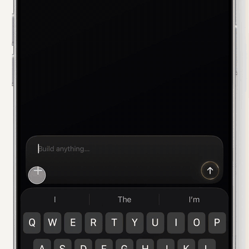

<table>
  <tr>
    <td width="260" align="center">
      
    </td>
    <td valign="middle">
      <h3><a href="https://github.com/AetherMaker/surface-forge">SurfaceForge</a></h3>
      
SwiftUI + Metal surfaces that react to device tilt.

    </td>
  </tr>
  <tr>
    <td width="260" align="center">
      
    </td>
    <td valign="middle">
      <h3><a href="https://github.com/AetherMaker/FanPicker">FanPicker</a></h3>
      
Hold, drag, and scroll through recent photos.

    </td>
  </tr>
</table>
